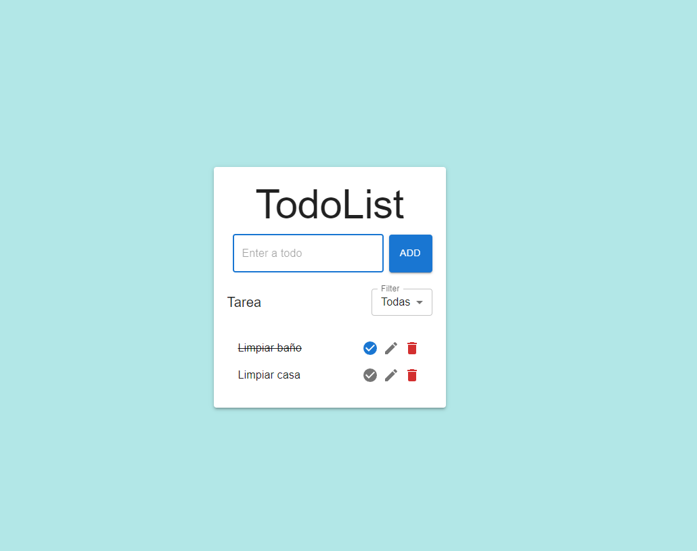

# 📝 To-Do List App



Una aplicación de lista de tareas simple y funcional construida con React y Material-UI.

## 🎥 Video Demo

Puedes descargar y ver el video demo [aquí](./imagenes/Grabación%20de%20pantalla%202024-07-05%20200345.mp4).

## 🚀 Características

- **Agregar Tareas**: Permite agregar nuevas tareas a la lista.
- **Editar Tareas**: Permite modificar las tareas existentes.
- **Eliminar Tareas**: Permite eliminar tareas de la lista.
- **Completar Tareas**: Permite marcar tareas como completadas.
- **Filtrar Tareas**: Permite filtrar las tareas para mostrar todas, solo las completadas o solo las incompletas.
- **Persistencia de Datos**: Las tareas se almacenan en `localStorage`, por lo que persisten entre recargas de página.
- **Diseño Responsive**: La aplicación es responsiva y se ve bien en dispositivos móviles y tabletas, tanto en modo retrato como apaisado.

## 🔧 Tecnologías Utilizadas

- **React**: Biblioteca de JavaScript para construir interfaces de usuario.
- **Material-UI**: Biblioteca de componentes de interfaz de usuario basada en Material Design.
- **react-hook-form**: Biblioteca para manejar formularios en React.
- **uuid**: Biblioteca para generar identificadores únicos universales (UUID).

## 📂 Estructura del Proyecto

```plaintext
src/
|-- components/
|   |-- header/
|   |   |-- Header.jsx
|   |-- form/
|   |   |-- Form.jsx
|   |-- todoList/
|   |   |-- TodoList.jsx
|   |   |-- Filter.jsx
|   |   |-- TodoItem.jsx
|   |   |-- DeleteModal.jsx
|-- App.jsx
|-- App.css
